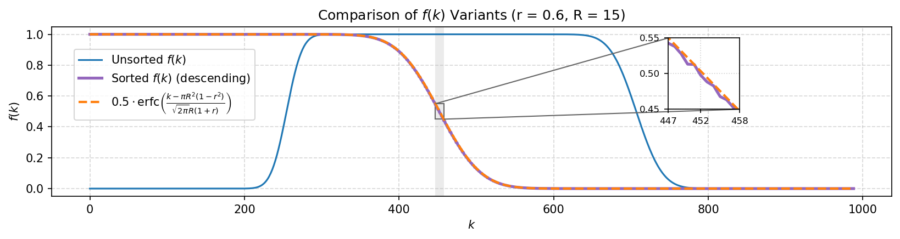
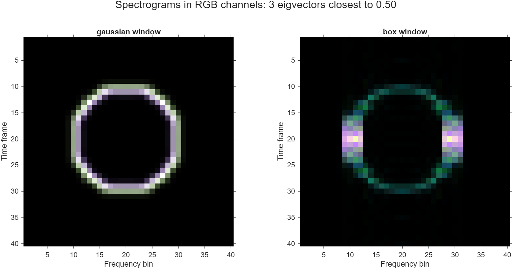

# Companion repository to "Empirical plunge profiles of time-frequency localization operators"

  

This repository contains code to repeat the main experiments of the paper <a href="https://arxiv.org/abs/2502.11805">Empirical plunge profiles of time-frequency localization operators</a>. Inside the `LTFAT` folder, <a href="https://github.com/SimonHalvdansson/Time-Frequency-Plunge-Profiles/blob/main/ltfat-2.6.0/plunge_profile.m">`plunge_profile.m`</a> contains the code for the main figures in the paper. Change the `load_symbol` argument to change the symbol. The code for the RGB figure can be found in <a href="https://github.com/SimonHalvdansson/Time-Frequency-Plunge-Profiles/blob/main/ltfat-2.6.0/acc_spec_color.m">`acc_spec_color.m`</a> file. For the figure comparing different windows, use the `acc_spec_color.m` routine.

The python file <a href="https://github.com/SimonHalvdansson/Time-Frequency-Plunge-Profiles/blob/main/f(k)_plot.py">`f(k)_plot.py`</a> contains a numerical verification of Proposition 2.2 which was used to produce Figure 1 in the paper.

### Sorted eigenvalues validation

  

### Window dependence on eigenvalue spectrogram separation 

  

